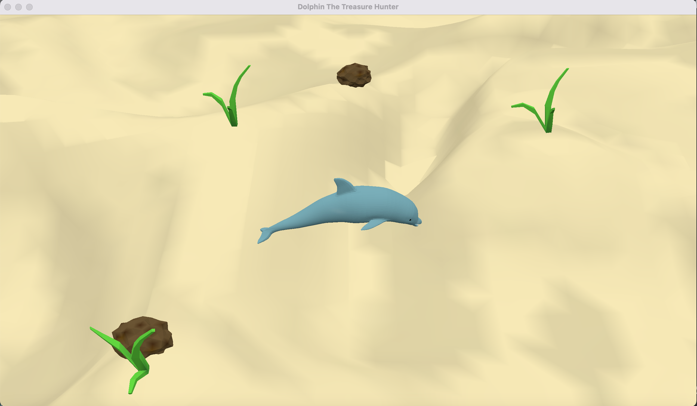

# Dolphin The Treasure Hunter

Author: Qiru Hu

Design: The dolphin uses sonar to hunt treasure in the ocean. If the dolphin makes sound in the correct direction, it can hear the echo.

Screen Shot:

How To Play:

Dolphin can move via:
- A to rotate left
- D to rotate right
- W to move forward
- S to move backward

Dolphin can make whistling using spacebar. If the chest locates in the forward direction of the dolphin, dolphin can hear an echo. This helps dolphin to find the chest. 

The player wins when the chest is found.

This game was built with [NEST](NEST.md).
